# Hello! This is Zao-chen! 👋

### 📊 Overview | 实时概况

|  |  |
| :----: | :----: |
|  |  |

---

### 💻 Languages | 编程语言

**Active / 学习中**
* **C++**
* **Qt**
* **Unreal Engine 5**

**Inactive / 摆烂中 (On Hold)**
* Kotlin
* Java
* Python
* ~~(易语言)~~

---

### 🛠️ Projects | 制作方向

- 🐏 **C++ & Qt Projects** - *Misc experiments / 写的一些乱七八糟的玩意*
- ⭐ **Indie Game Dev** - *Developing with UE5 / ue5开发独立游戏*
- 🍮 **Android** - *Small apps & widgets / 写的小玩意*
- 🔌 **Minecraft** - *Bukkit/Spigot Plugins / 插件*
- 🦴 ~~**EPL Stuff** - *Legacy code / 易语言乱写的东西*~~

---

[🌐 Personal Blog (个人博客)](https://zao-chen.github.io/)

[☕ Buy me a coffee (爱发电)](https://afdian.com/a/Zao_chen)
