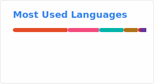

# Hello! I'm GreatZaochen 👋

---

### 📊 Overview

|  |  |
| :---------------------------: | :---------------------------------------: |
|  |  |

---

### 💻 Languages

#### 🚀 Active
- **C++ Ecosystem** — Qt (GUI) · Unreal Engine 5 (Game Development)
- **Dart / Flutter** — Cross-platform Development (Mobile · Desktop · Web)

#### 💤 On Hold
- **Java** — Previously built Minecraft plugins
- ~~**EPL**~~ — Old experimental stuff

---

### 🛠️ Projects

- 🐏 **C++ / Qt Projects** — Experimental tools & desktop apps
- ⭐ **Indie Game Development** — Building games with UE5
- 🍮 **Cross-platform Apps** — Small utilities & widgets
- 🔌 **Minecraft Plugins** — Bukkit / Spigot

---

### 🌐 Links

- 🌍 [Blog](https://zao-chen.github.io/)
- ☕ [Buy me a coffee](https://afdian.com/a/Zao_chen)
